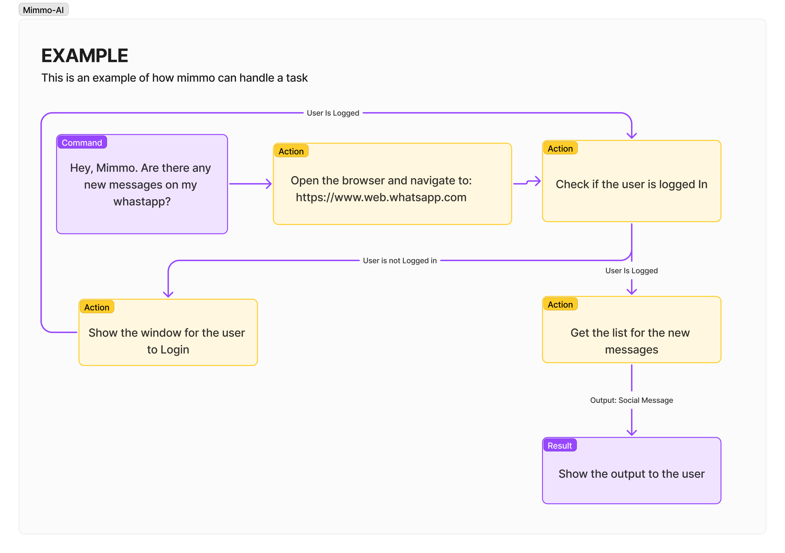

# 🤖MImmo - AI✨

> ⚠️ WARNING: This project is under development and many changes will be done
> untill reaching the final goal.

Feel free to contribute with documentation, suggestions, code or testing it on
your.

### Overview

Mimmo is a general purpose AI assistent that can do anything you want. It can
browse the internet, chat with your friends, manage your emails or even your
computer.

> Command editor where the community can create commands that can be run by
> mimmo.

This Repository containes the source code for the desktop cliente and the web
interface of the Mimmo project.

## Project structure

### Branches

There are three important branches in this repo.

`desktop-client` The development branch for the OS related features (The Flutter
project)

`web-interface` The development branch for the UI and voice commands.

`master` Contains the most updated version of the `web-interface` and the
`desktop-client`.

---

The project is divided in 3 main Parts:

### Desktop Client:

Flutter project that can be found in `mimmo_desktop_client`

### Web interface:

Vite project with React. Can be found in `mimmo_web_interface`

### [Pocketbase](https://github.com/pocketbase/pocketbase) (Not integrated yet):

Local database for cache and store some informations locally.

### [Ollama](https://github.com/ollama/ollama)

To run LLM Locally

---

I choose flutter because I want Mimmo to have OS level access so it can interact
with computer resources and file system. This makes it more powerfull then other
assistents.

The web interface is used for the main panel UI and for the browser (chrome)
native speech to text trasncription so the user can speak with Mimmo without the
need of another AI ai

> This can be replaced with Whisper in the feature.

Pocketbase is an awesome realtime database that the user can use locally because
we won't going to store users personal information in the cloud.

## Basic structure: `Ongoing...`

| Feature          | Description                                                   | State |
| ---------------- | ------------------------------------------------------------- | ----- |
| Web Interface    | Integrate the web interface to the Desktop Client             | 🔃    |
| Visual Interface | Create the main panel where users can create Plugins/Commands | ❌    |
| Core Nodes       | Create The core nodes that can be used to interact with Mimmo | ❌    |

- ❌ - Not done yet.
- 🔃 - Working on it
- ✅ - Done.

## Example of a Mimmo Command flow

This diagram shows in hight level how a task can be handled by mimmo.

